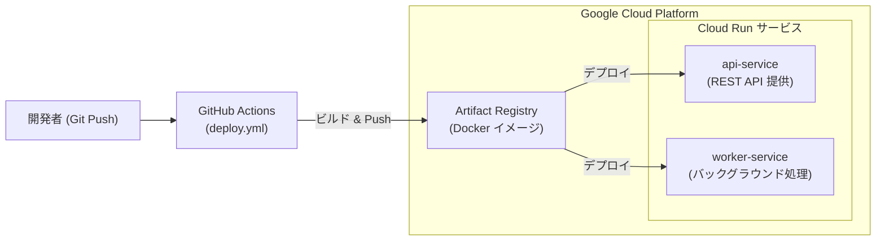

# Google Cloud Run Services

Google Cloud Run を活用し、Python ベースの Web API および非同期タスク処理ワーカーを運用するためのリファレンス実装です。  
GitHub Actions と連携し、コンテナイメージのビルドから Cloud Run への自動デプロイまでを管理します。

---

## アーキテクチャとデプロイフロー



---

## サービス構成

```text
google-cloud-practice/
├── services/
│   ├── api-service/          # RESTful API サービス（Flask / FastAPI 等）
│   │   ├── app.py
│   │   ├── requirements.txt
│   │   └── Dockerfile
│   └── worker-service/       # バックグラウンドタスク処理サービス
│       ├── app.py
│       ├── requirements.txt
│       └── Dockerfile
└── .github/workflows/
    └── deploy.yml            # CI/CD パイプライン定義
```

---

## ローカルでの開発・実行

各サービスディレクトリ内で Docker またはローカルの Python 環境を利用して実行できます。

### Docker での実行

```bash
# API Service のビルドと起動
cd services/api-service
docker build -t api-service .
docker run -p 8080:8080 api-service

# Worker Service のビルドと起動
cd ../worker-service
docker build -t worker-service .
docker run -p 8081:8080 worker-service
```

起動後、`http://localhost:8080/health` や `http://localhost:8081/health` でヘルスチェックを確認できます。

---

## デプロイ設定の要点

### 1. 必要な GCP リソース
- **Cloud Run**: API と Worker の各サービス実行環境
- **Artifact Registry**: Docker コンテナイメージのリポジトリ
- **IAM サービスアカウント**: GitHub Actions からデプロイを行うための権限（`roles/run.admin`, `roles/artifactregistry.writer`, `roles/iam.serviceAccountUser`）

### 2. GitHub Secrets
GitHub リポジトリの Settings → Secrets に以下を設定します。
- `GCP_SA_KEY`: デプロイ用サービスアカウントの JSON キー

### 3. 自動デプロイ
`main` ブランチへの push またはプルリクエストのマージをトリガーに、GitHub Actions がコンテナをビルドして Cloud Run へ自動反映します。